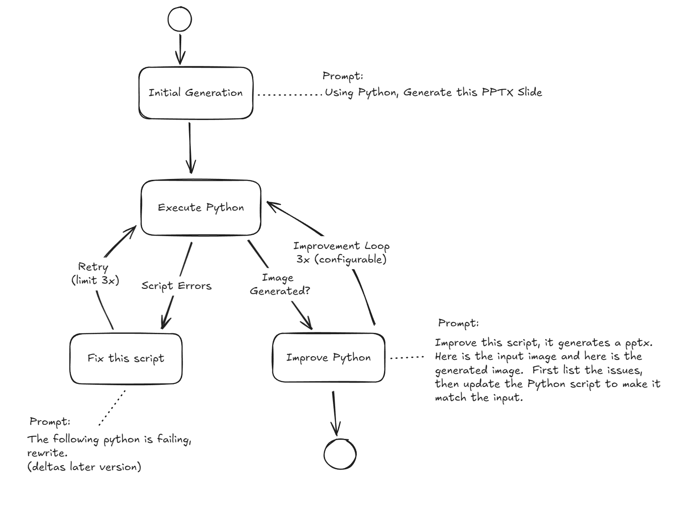

## Python SlideGen

Python SlideGen is an LLM-driven tool that automates the creation of PowerPoint slides. It takes a natural language prompt, an optional reference image for layout, and optional asset images, and generates a complete `.pptx` slide.

The core of the process is a multi-step workflow that uses a Large Language Model (LLM) to:
1.  **Generate a Python script**: Based on the user's prompt, it creates a `python-pptx` script to build the slide.
2.  **Execute and Capture**: The script is run, producing a `.pptx` file. A screenshot of the slide is then taken.
3.  **Score and Iterate**: The LLM scores the resulting slide against the original prompt. If the score is too low or the script fails, it enters a fix-and-improve loop, generating a new script until the quality target is met.

This iterative process ensures a high-quality output that aligns with the user's request. All artifacts, including generated scripts, logs, and slides, are saved for each run.



### Quick Start

**Prerequisites:**

Screenshot generation requires LibreOffice. See [HEADLESS_SETUP.md](HEADLESS_SETUP.md) for platform-specific installation instructions.

**Setup:**

1.  **Install Dependencies:**
    This project uses `uv` for dependency management. Install the required packages by running:
    ```sh
    uv sync
    ```

2.  **Configure Environment:**
    Create a `.env` file in the project root. For mock mode (no OpenAI API key needed), you can use:
    ```env
    OPENAI_USE_MOCK=true
    ```
    To use the OpenAI API, provide your credentials:
    ```env
    OPENAI_API_KEY="sk-..."
    # OPENAI_DEFAULT_MODEL="gpt-4o"
    # OPENAI_VISION_MODEL="gpt-4o"
    ```
    See the **Configuration** section below for more details on available settings.

3.  **Run the CLI:**
    Use `uv run` to execute the slide generation script.

    **Examples:**
    ```sh
    # Simple slide with text
    uv run slidegen --prompt "Quarterly Results\nRevenue up 25%\nExpanding to new markets"

    # With asset images (note the 'name|/path/to/image|description' format)
    uv run slidegen --prompt "Product Launch" --image "logo|C:/images/logo.png|Company logo, top-right" --image "chart|C:/images/chart.png|Sales chart, center"

    # With a reference image for layout guidance
    uv run slidegen --prompt-file "presentation.txt" --reference-image "C:/layouts/corporate_template.png"

    # Force mock mode for a quick test
    uv run slidegen --prompt "Team Overview" --mock-openai
    ```

**What Happens:**

*   The CLI generates a PowerPoint slide based on your prompt.
*   The best-scoring slide is automatically saved to your workspace root (e.g., `slide_20251116_123456.pptx`).
*   All artifacts, including scripts, logs, intermediate presentations, and screenshots, are stored in the `runs/<run_id>/` directory for inspection.
*   A JSON summary is printed to the console with the run ID, final score, and output file locations.

### CLI Options

| Argument | Description |
| --- | --- |
| `--prompt "text"` | Inline prompt text. Use `\n` for line breaks. |
| `--prompt-file <path>` | Path to a text or markdown file containing the prompt. |
| `--image <spec>` | Adds an asset image to be embedded in the slide. The format is `name|/absolute/path/to/image.png|description`. This option can be used multiple times. |
| `--reference-image <path>` | Optional path to a reference image for layout guidance (the image is not embedded). |
| `--output-dir <path>` | Overrides the default output directory (`runs`). |
| `--mock-openai` | Forces mock mode, which generates deterministic slides without calling the OpenAI API. |
| `--real-openai` | Forces real OpenAI API usage, even if a key is not detected. |
| `--run-id <id>` | Sets a custom identifier for the run. |

### Configuration

The application is configured via environment variables, which can be placed in a `.env` file in the project root.

#### Core Settings
| Variable | Description | Default |
| --- | --- | --- |
| `OPENAI_USE_MOCK` | If `true`, the application runs in mock mode without using the OpenAI API. | `true` if no API key is found |
| `DEFAULT_OUTPUT_DIR` | The directory where run artifacts are stored. | `./runs` |
| `WORKSPACE_DIR` | The root directory of the workspace. | Current working directory |

#### OpenAI Settings
| Variable | Description | Default |
| --- | --- | --- |
| `OPENAI_API_KEY` | Your OpenAI API key. | `None` |
| `OPENAI_DEFAULT_MODEL` | The model used for text and script generation. | `gpt-4o-mini` |
| `OPENAI_VISION_MODEL` | The model used for vision-related tasks (e.g., analyzing reference images). | `gpt-4o-mini` |
| `OPENAI_REASONING_EFFORT` | Controls the reasoning depth of the model. Can be `minimal`, `low`, `medium`, or `high`. | `medium` |

#### Azure OpenAI Settings
| Variable | Description | Default |
| --- | --- | --- |
| `USE_AZURE` | Set to `true` to use Azure OpenAI services. | `false` |
| `AZURE_OPENAI_API_KEY` | Your Azure OpenAI API key. | `None` |
| `AZURE_OPENAI_ENDPOINT` | The endpoint for your Azure OpenAI resource. | `None` |
| `AZURE_OPENAI_DEPLOYMENT` | The name of your Azure OpenAI deployment. | `None` |
| `AZURE_OPENAI_API_VERSION` | The API version to use. | `2024-10-21` |

#### Behavior Settings
| Variable | Description | Default |
| --- | --- | --- |
| `MAX_SCRIPT_RETRIES` | The maximum number of times to retry a failed script. | `3` |
| `MAX_IMPROVEMENT_ITERATIONS` | The maximum number of improvement loops to run. | `2` |
| `EXECUTION_TIMEOUT_SECONDS` | The timeout for running a generated Python script. | `120` |
| `TARGET_SCORE_THRESHOLD` | The target score (out of 100) to achieve before stopping the improvement loop. | `80` |

#### Scoring Weights
The final score is a weighted average of several dimensions. The weights must sum to 1.0.
| Variable | Description | Default |
| --- | --- | --- |
| `SCORE_WEIGHT_COMPLETENESS` | Weight for prompt completeness. | `0.3` |
| `SCORE_WEIGHT_CONTENT_ACCURACY` | Weight for content accuracy. | `0.3` |
| `SCORE_WEIGHT_LAYOUT_MATCH` | Weight for layout match against the reference image. | `0.25` |
| `SCORE_WEIGHT_VISUAL_QUALITY` | Weight for overall visual quality. | `0.15` |


### Development

- **Run Unit Tests:**
  ```sh
  uv run pytest
  ```
- **Run the Orchestrator Locally:**
  ```sh
  uv run slidegen --prompt "Title\nBullet one" --mock-openai
  ```

### Architecture Highlights

- **`slidegen.config`**: Loads `.env` settings and environment variables into a typed `Settings` object.
- **`slidegen.prompt_store`**: Loads and formats text-based prompt templates from the `prompt_templates` directory.
- **`slidegen.openai_client`**: A mock-friendly façade for interacting with LLMs. It generates `python-pptx` scripts, manages fix/improve cycles, and performs scoring.
- **`slidegen.state`**: A state machine that orchestrates the entire workflow: generation, execution, screenshotting, scoring, and improvement loops.
- **`slidegen.execution`**: Runs generated scripts in a secure subprocess, validates the output PPTX, and captures logs.
- **`slidegen.screenshot`**: Captures slide screenshots using headless LibreOffice and PyMuPDF for high-fidelity, server-friendly rendering.
- **`slidegen.scoring`**: Aggregates scores from the LLM based on the configured weights.

Refer to `AGENT.md` for the development guidelines that were applied to this project.

### How The Workflow Runs

1.  **Prompt Intake**: The CLI validates the user's prompt, asset image specifications, and optional reference layout image.
2.  **Script Generation**: `OpenAIClient` formats a prompt template with the run context and sends it to the LLM to generate a `python-pptx` script. In mock mode, a deterministic script is used instead.
3.  **Script Execution**: The `ExecutionEngine` runs the generated script in a sandboxed environment, validates the resulting `.pptx` file, and saves all logs.
4.  **Screenshot Capture**: `ScreenshotService` converts the generated slide into a PNG image for visual inspection and scoring.
5.  **Scoring**: `ScoringService` uses the LLM to rate the slide across several dimensions (completeness, accuracy, etc.) and calculates a weighted final score.
6.  **Fix/Improve Loops**: If the script fails, a "fix" prompt is sent to the LLM. If the slide's score is below the target threshold, an "improvement" prompt is sent. This loop continues until the target score, retry limit, or iteration limit is reached.
7.  **Artifacts & Metadata**: Every run produces scripts, `.pptx` files, screenshots, logs, and a `metadata.json` file that describes the entire process, including iteration history and scores. All artifacts are saved in the `runs/<run_id>/` directory.

